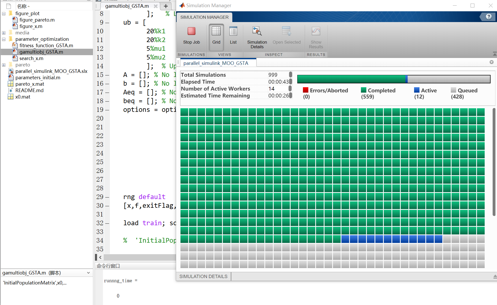
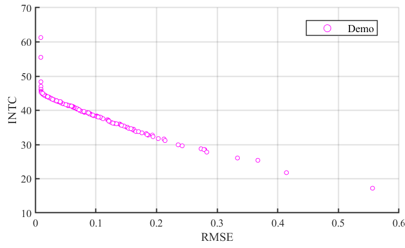
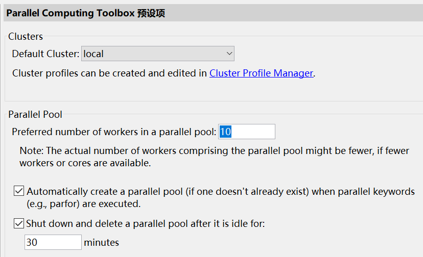

# Parallel multi objective optimization with Simulink & MATLAB
This is just a simple example of how to optimize parameters in simulink models;  Parallel computing can greatly increase speed.

 

## How to run
* run gamultiobj_GSTA.m (add this folder in your path)
* recommed MATLAB 2018b, the newer version should also work. However, it may cause some unexpected problems.

Change the parallel number you want in the parallel perferences, the maxmium number depends on your CPU's threads number.

